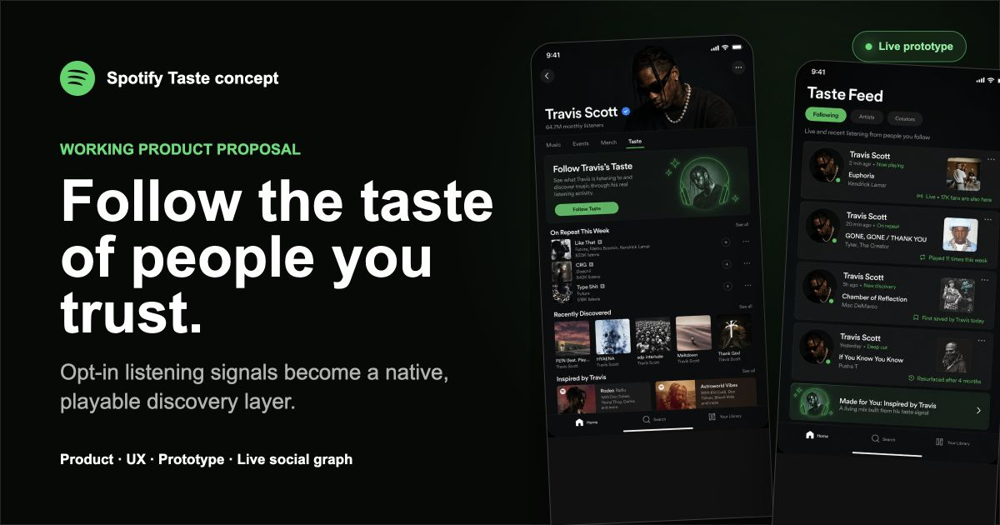
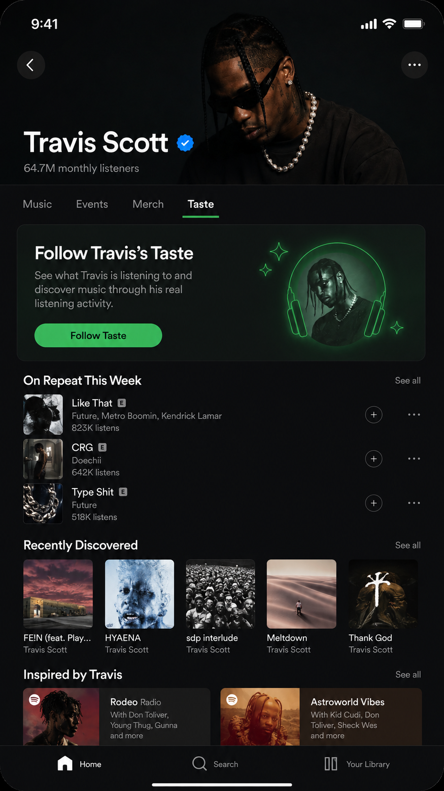
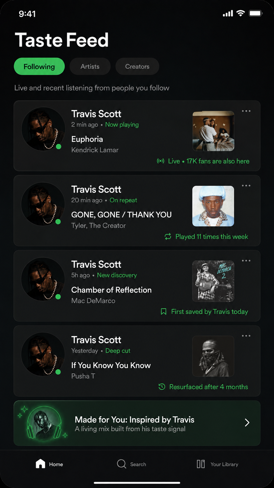
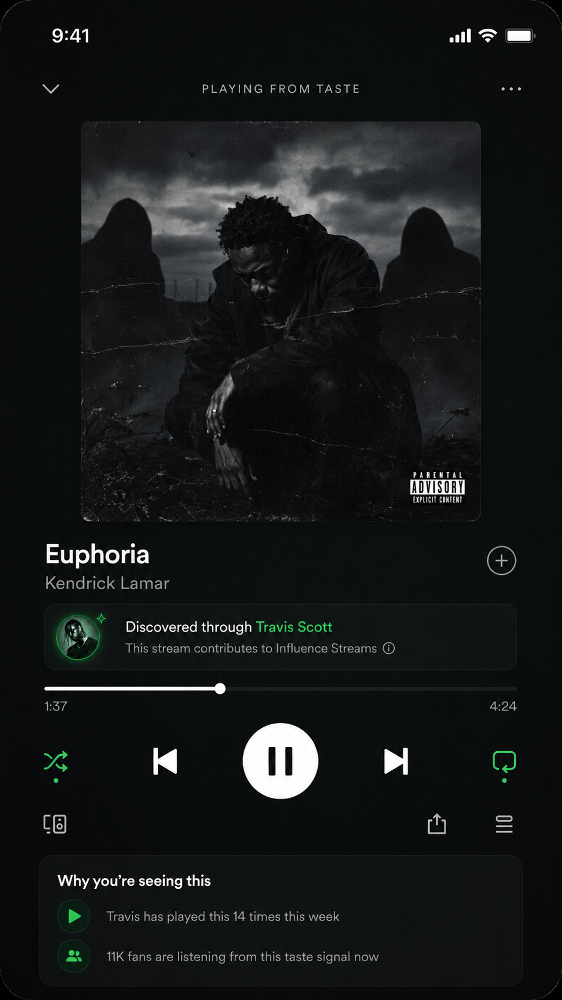
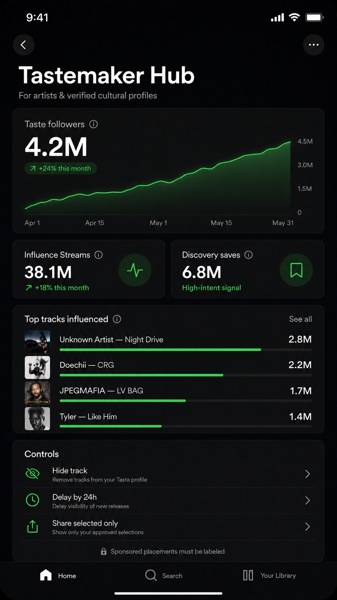
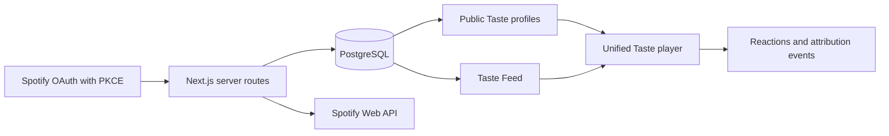

# Follow Taste

### Human-led music discovery for Spotify

Spotify is excellent at algorithmic discovery. Follow Taste adds a complementary signal: music discovered through specific people whose taste you trust.

[**Open the live product**](https://spotify-taste-prototype.vercel.app/) · [**View the product proposal**](https://spotify-taste-prototype.vercel.app/pitch) · [**Watch the 41-second demo**](https://spotify-taste-prototype.vercel.app/demo) · [**LinkedIn**](https://www.linkedin.com/in/safonovivan/)



> Independent product concept by Ivan Safonov. Not affiliated with, endorsed by, or sponsored by Spotify.

## The product insight

Music discovery is not only a relevance problem. It is also a trust problem.

Follow Taste turns opt-in listening activity into a followable discovery layer. A listener can follow an artist, creator, friend, DJ, journalist, or cultural figure; play their shared listening history as a continuous queue; read an optional author note; and understand who caused a meaningful discovery.

The core loop is intentionally native to Spotify:

1. Open an artist or listener profile.
2. Follow their Taste.
3. See their shared listening signals in Taste Feed.
4. Play an individual track or the complete queue.
5. Attribute later saves, repeats, and durable listening to the original tastemaker.

## Product surfaces

<table>
  <tr>
    <td align="center"><br><strong>Artist Taste</strong></td>
    <td align="center"><br><strong>Taste Feed</strong></td>
    <td align="center"><br><strong>Unified player</strong></td>
    <td align="center"><br><strong>Tastemaker Hub</strong></td>
  </tr>
</table>

## What works today

- Spotify Authorization Code with PKCE. No client secret is shipped to browser code.
- Encrypted server-side Spotify token storage and `httpOnly` application sessions.
- Import from authorized recently played, short-term top tracks, and top artists.
- Seven-day history grouped by track and ranked by repeat count, then Spotify popularity.
- Stable public Taste profiles at `/taste/<handle>`.
- Database-backed follows, author notes, track reactions, notifications, and a shared Taste Feed.
- One continuous playback queue across artist profiles, listener profiles, and the feed.
- Full Spotify playback for eligible Premium sessions with a graceful preview fallback.
- Per-account sharing controls, a 24-hour delay, selected-only publishing, and hidden Spotify IDs.
- English by default with an optional Russian interface.
- Responsive product, pitch, and demo experiences for mobile and desktop.

## What is real and what is illustrative

Real Spotify accounts authorize their own data. Their profile image, listening signals, follows, author notes, reactions, and privacy settings are stored in the production database and shared only according to their settings.

The Travis Scott profile, celebrity listening history, audience-scale influence metrics, and Tastemaker Pool economics are explicitly illustrative. Access to a public figure's real listening activity would require that person's consent and Spotify's internal product infrastructure.

## Architecture



| Layer | Implementation |
| --- | --- |
| Product | Next.js 16, React 19, TypeScript |
| Data | Neon/PostgreSQL through the `postgres` driver |
| Authentication | Spotify OAuth Authorization Code with PKCE |
| Sessions | Signed `httpOnly` cookies; encrypted server-side refresh tokens |
| Playback | Spotify Web API for eligible Premium users; official Spotify embeds as fallback |
| Hosting | Vercel with a protected daily sync job |

## Privacy model

Follow Taste is opt-in by design. Users can keep all activity private, publish only selected listening, delay publication by 24 hours, or hide individual tracks and artists. Author notes can be written only by the owner of the Taste profile. Followers can react to the recommended track but cannot edit the author's context.

## Running locally

```bash
cp .env.example .env.local
npm install
npm run dev
```

Required environment variables are documented in `.env.example`. The database schema is created idempotently on the first server request.

Register this exact local redirect URI in Spotify Developer Dashboard:

```text
http://localhost:3000/api/auth/spotify/callback
```

For production:

```text
https://YOUR_DOMAIN/api/auth/spotify/callback
```

## Spotify Development Mode

Spotify Development Mode currently requires the app owner to have Premium and limits access to up to five allowlisted authenticated users. The public concept, product proposal, and demo video remain available without Spotify authentication.

See Spotify's official documentation for current [quota modes](https://developer.spotify.com/documentation/web-api/concepts/quota-modes) and [developer access rules](https://developer.spotify.com/blog/2026-02-06-update-on-developer-access-and-platform-security).

## Deployment

1. Connect the repository to Vercel.
2. Add a Neon/PostgreSQL integration so `DATABASE_URL` is available.
3. Set `SPOTIFY_CLIENT_ID`, `SESSION_SECRET`, `TOKEN_ENCRYPTION_KEY`, `CRON_SECRET`, and `NEXT_PUBLIC_APP_URL` for Production, Preview, and Development.
4. Register the final production callback URL in Spotify Developer Dashboard.

`vercel.json` runs a protected daily sync at `03:00 UTC`. Profile visits and the owner's manual sync action also refresh stale listening history.

Never put a Spotify client secret in `NEXT_PUBLIC_*`, source code, or Git. This implementation does not require one.

## Contact

**Ivan Safonov** — independent product builder and AI-native prototyper<br>
[LinkedIn](https://www.linkedin.com/in/safonovivan/) · [safonov47@gmail.com](mailto:safonov47@gmail.com)

The detailed Russian product walkthrough is available in [`docs/PRODUCT_WALKTHROUGH_RU.md`](docs/PRODUCT_WALKTHROUGH_RU.md).
